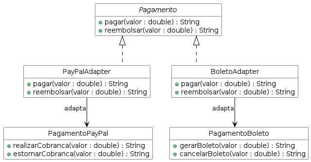

# Integração de Meios de Pagamento

Sistema que unifica diferentes meios de pagamento — cada um com sua própria API — sob uma interface comum.

## Domínio

Uma loja precisa aceitar PayPal e Boleto. O PayPal usa `realizarCobranca()` e `estornarCobranca()`; o Boleto usa `gerarBoleto()` e `cancelarBoleto()`. O sistema de vendas não deve conhecer essas diferenças — apenas chamar `pagar()` e `reembolsar()`.

## Padrão aplicado

**Adapter** — a interface `Pagamento` define o contrato esperado pelo cliente. `PayPalAdapter` e `BoletoAdapter` implementam essa interface e traduzem as chamadas para os métodos específicos de cada serviço legado (`PagamentoPayPal` e `PagamentoBoleto`). O cliente opera sobre a interface sem saber qual serviço está por baixo.

## Como rodar

```bash
cd Java-Adapter
mvn test
```

7 testes passando.

## Diagrama de classes


